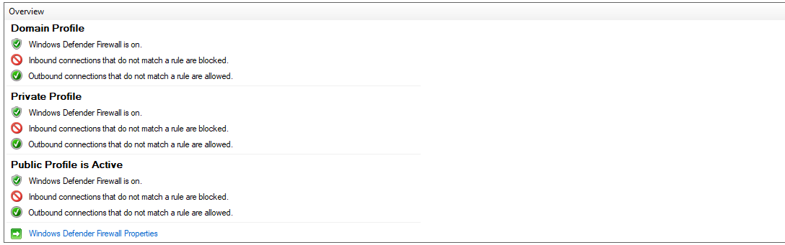
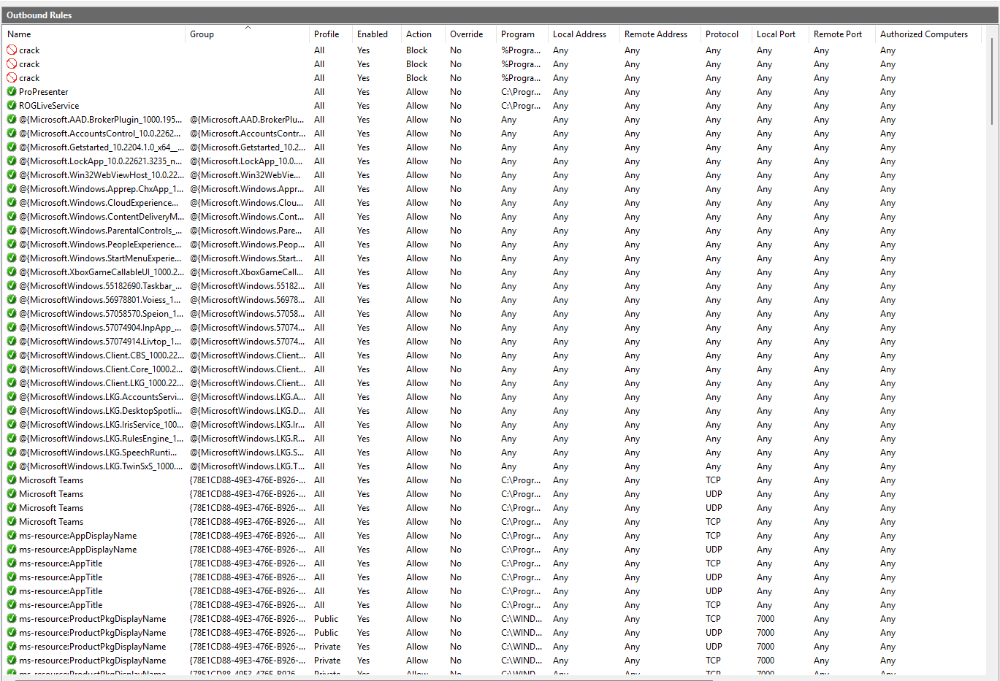
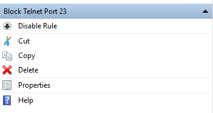
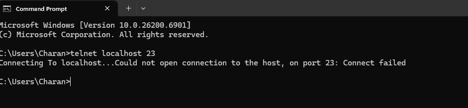
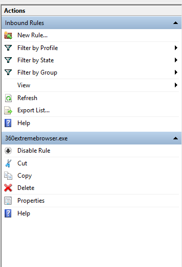

# 🔒 Task-04: Firewall Configuration and Traffic Filtering

## 🎯 Objective
To understand how a firewall filters network traffic and manage firewall rules to allow or block specific ports.

## 🧰 Tools Used
- **Windows Firewall** (for Windows users)
- **UFW (Uncomplicated Firewall)** (for Linux users)

---

## 🪟 Windows Firewall Configuration

### 1️⃣ Open Firewall Configuration Tool
Press **Windows + R** → Type `wf.msc` → Hit **Enter**

📸 **Screenshot Example:**



### 2️⃣ List Current Firewall Rules
Go to **Inbound Rules** or **Outbound Rules** in the left panel.

📸 **Screenshot Example:**



### 3️⃣ Block Inbound Traffic on Port 23 (Telnet)
1. Click **Inbound Rules** → **New Rule** → **Port** → **TCP** → **Specific local ports: 23**
2. Choose **Block the connection** → Apply to all profiles → Name as **"Block Telnet Port 23"**

📸 **Screenshot Example:**



### 4️⃣ Test the Rule
Open **Command Prompt** and run:
```cmd
telnet localhost 23
```

**Expected Output:** Connection failed or refused

📸 **Screenshot Example:**



### 5️⃣ Remove the Test Block Rule
Go back to **Inbound Rules** → Find **"Block Telnet Port 23"** → Right-click → **Delete**

📸 **Screenshot Example:**



---

## 🧾 Command Summary Table
| Action | Windows Command/Steps |
|--------|----------------------|
